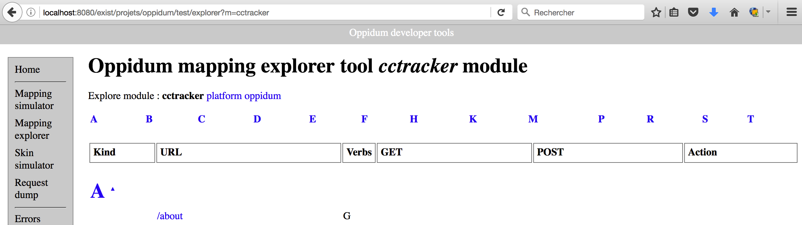

# Architecture and conventions

Please take the [grand tour](./tour.md) first to get an overiew of the application features before reading that chapter.

## User interface overview

The application landing page upon successful login is called the *stage* (or the dashboard). It displays a search mask and a results list to retrieve and navigate into a case and/or activity. It is structured into three vertically laid down parts :

* a top primary navigation bar (or application menu) with drop down menus
* a search mask
* a result table

The application also comprises transversal search pages like search for persons, enterprises or regions. They have a similar layout. Statistics pages too : the search masks allows to select a case and/or activity sample set and the results area displays several tables and associated graphs.

The case and activity workflow view are more specific. They show a current workflow status on a time line widget at the top (just below the application menu), and a list of documents on an accordion widget some of which can be edited in place depending of the worklow status and user's rights.

Some listing pages like the todo lists or data export pages, do not have a specific layout, they just show tables or summaries for printing or navigating into cases and/or activities.

Finally a management page groups on a vertical tab below the application menu several management functionalities like user's account management to create user's login and renew passwords.

The navigation structure is implemented both in mesh files (inside the *mesh* folder) and in specific functions of the *epilogue.xql* file according to Oppidum conventions.

## Programming style

### Patterns

The Case Tracker source code implements a limited set of patterns and constructs : 

1. XML configuration files (see next section) that describe application behavior
2. dynamical formulars pre-generated with [Supergrid](./supergrid.md) embedded inside [UI widgets](./components.md)
3. client-side [Commands](./commands.md) hosted on [UI widgets](./components.md)
4. client-server interactions using several [Ajax protocols](./ajax.md) (XML or JSON)
5. CRUD controllers to update application entities into the database (including functional dependencies handling or splitting of entities into multiple database locations)

Points 2. and 3. use HTML micro-format attributes (e.g. *data-command="save"*) for associating formulars and commands with user-interface components.

### Specification driven

The Case Tracker follows a *specification driven programming* style. Core programming involves using or inventing small pieces of developer-friendly XML vocabularies (or *Domain Specific Languages* - DSL). For instance specific vocabularies describe most of the workflow transitions and access control rules, and user interface components of the application. Thus a huge part of the application source code and librairies implements XML vocabularies interpretors and generators. It follows that an important part of the programming effort is to write XML configuration files that directly translate business specifications and requirements. 

In summary *application programming* is splitted into editing XML configuration files and creating some XQuery controllers to update the database content.

The two tables below show different configuration files in use by the Case Tracker and their location in the file system. These files must be deployed into the application configuration in the database (`/db/www/{app}/config`) by the deployment script. 

The Oppidum framework itself comes with a set of XML vocabularies. They are listed in the table below.

| File                   | Location                | Goal |
|:-----------------------|:------------------------|:-----|
| dictionary.xml         | config                  | application localisation strings |
| errors.xml             | config                  | application error messages |
| mapping.xml            | config                  | application REST mapping |
| messages.xml           | config                  | application information messages |
| modules.xml            | config                  | application REST mapping modules |
| skin.xml               | config                  | application CSS and Javascript dependencies |

Then the Case Tracker application adds more XML vocabularies for higher level functionalities. They are listed in the table below.

| File                   | Location                 | Goal |
|:-----------------------|:-------------------------|:-----|
| application.xml        | config                   | workflows, document access rights |
| checks.xml             | modules/alerts           | todo list computation and e-mail reminders |
| email.xml              | data/global-information  | e-mail templates  |
| global-information.xml | data/global-information  | data types definition for selectors (drop-down lists, etc.)  |
| proxies.xml            | config                   | data model functional dependencies |
| security.xml           | config                   | thrid party identity providers specification |
| services.xml           | config                   | inter-applications communication |
| settings.xml           | config                   | application global parameters |
| stats.xml              | modules/stats            | masks, graphs and export table for statistics |
| variables.xml          | config                   | variables definition for e-mail templates |
| {formular}.xml         | formulars/{formular}.xml | supergrid XML formular specifications |
| _register.xml          | formulars                | formulars registery |

## Code conventions

The code is divided between server-side code, XML application configuration files and client-side code all stored in the git depot.

The code layout at the 1st-level folder is a direct application of the coding conventions as summarized in the table below.

| 1st-level folder | Description |
|:-----------------|:------------|
| build            | configuration files to build external dependencies (e.g. AXEL library) |
| caches           | files to bootstrap caches |
| config           | configuration files to be loaded into config collection |
| data             | data files to be loaded into global-information collection |
| debug            | files to bootstrap tracing (debug.xml, login.xml) using debug collection |
| formulars        | search mask and/or document formular XML definitions |
| indexes          | collection.xconf files to create DB indexes |
| lib              | shared XSLT libraries and XQuery modules |
| mesh             | application mesh files (equivalent to application page templates) |
| models           | generic XQuery models |
| modules          | parent folder for CRUD controllers and resources usually grouped in sub-folders by entity or functionality |
| resources        | parent folder for static resources (CSS, js, etc.) |
| scripts          | installation script (bootstrap, deployment, etc.) |
| templates        | XTiger templates to be loaded into mesh collection (not much used since most XTiger templates are generated from formular definitions by supergrid) |
| test             | test files |
| untracked        | static files not under version control served by the application  |
| views            | generic XSLT views |

### Server-side code

The `lib` folder contains shared XSLT libraries and shared XQuery modules to include in XSLT views (resp. in XQuery models). Some of them are generic enough to be copy/pasted bewteen applications (e.g. `commons.xsl` for generic UI widgets, `services.xqm` for inter-applications communications) while other may be more application specific (e.g. `forms.xqm` that contains functions to generate application drop-down lists).

The `views` folder contains generic XSLT views to integrate into pipelines (e.g. the `login.xsl` page).

The `models` folder contains generic XQuery models to integrate into pipelines (e.g. the `login.xql` script).

The `modules` folder is organized into **entity modules** and **functional modules**. Each one is stored in a sub-folder.

The sub-folders with an entity name (like `modules/cases` or `modules/persons`) manage the corresponding application entities (like Cases or Persons). They very often contain one or more XQuery CRUD controllers for the entity and it's associated content.

The sub-folders with an functionality name (like `modules/stats` or `modules/management`) group together the functionality implementation (like statistics or users's account and application configuration functionalities).

### Application configuration

Application configuration can be divided into **system configuration** and **data configuration**. System configuration is about defining the behavior of the application (e.g. workflow transitions, rules for alert notifications) and environmental settings (e.g. SMTP server address). Data configuration is for defining data contained in user generated content or to display to the user (e.g. data types definitions, e-mail templates content, localized labels, etc.).

The `config` folder (which will be copied to the `/db/www/cctracker/config` collection) contains the system configuration files.

The `data` folder  (which will be copied to the `/db/sites/cctracker/global-information` collection) contains the data configuration.

Some configuration files may also be scattered into functional modules (e.g. `modules/stats/stats.xml`). 

Finally the first level `formulars` folder contains formulars definition files, which can be considered in-between system and data configuration.

### Client-side code

The `resources` folder contains client-side code. Each major third party library is stored in its own sub-folder (e.g. bootstrap, d3, etc.). The only exceptions are the AXEL and AXEL-FORMS dependencies which are copied inside the `resources/lib` sub-folder (see below).

The `resources/lib` folder contains the Javascript code of the application. Some files are named after a functional module they implement (e.g. `stats.js` that implements client-side `modules/stats`), or after a set of transverse functionalities they implement (e.g. `search.js` for `module/persons` or `modules/regions` search). Most of the other files implement the case tracker specific AXEL and AXEL-FORMS widgets extensions (i.e. plugins, filters, bindings or commands javascript objets, see [AXEL](https://github.com/ssire/**axel**) and [AXEL-FORMS](https://github.com/ssire/**axel-forms**) documentation).

The `resources/css` and the `resources/images` sub-folders store respectively the case tracker CSS and image files.

The `resources/css/forms.css` file defines boostrap forms adaptations and specific forms CSS rules.

The system configuration `config/skin.xml` file defines the mapping bewteen the resource files and the application pages. It uses an Oppidum DSL.

Note that per Oppidum construction and per NGINX configuration the content of the first level resources folder is not served by eXist-DB but by NGINX.

## Data model

### Database implementation

The case tracker database follows the Oppidum framework conventions : 

* user generated content is stored in the `/db/sites/cctracker` collection (**data space**)
* application configuration is stored in the `/db/www/cctracker` collection (**configuration space**)

There is one exception for the `/db/sites/cctracker/global-information` collection that contains also application configuration data. In particular it contains all the data types definitions which are used to generate user interface selector menus, hence they belong more to the data space than the configuration space.

The data space is organized into the following main collections : 

* `/db/sites/cctracker/persons` : all users data (including user profiles for authentification and role management)
  * actually it contains a single persons.xml file and an images collection with all users photos
* `/db/sites/cctracker/cases` : all cases and activities
  * actually it is divided into YYYY/MM sub-collections where YYYY (resp. MM) is the case creation year (resp. month)
* `/db/sites/cctracker/enterprises` : all enterprises data (depending on controllers implementation this may be only users enterprises and not cases enterprises which are stored directly within cases)

Some other collections may be used if you activate specific services : 
  
* `/db/sites/cctracker/checks` : pre-computed todo lists by the alerts module as per *checks.xml* configuration
  * one file per check number
* `/db/sites/cctracker/reminders` : control lists of the reminders e-mail notification sent by the alert module as per *checks.xml* configuration 
  * one file per month containing reminders sent each night during the month
* `/db/sites/cctracker/timesheets` or any other terminal name (e.g. *docs*): collections to store uploaded PDF files attached to cases or activities
  * it contains a mirror hierarchy of sub-collections similar to the *cases* collection hierarchy

Finally there are a few collections outside of the data space and configuration space for extra services :

* `/db/debug` : optional debug files
  * `login.xml`: user access traces
  * `debug.xml` : e-mail output traces (content depends of the configuration in `settings.xml`)
* `/db/caches` : cache files to speed up `form.xql` models execution (pre-generated drop down lists options)
  * one collection/file per application `/db/caches/cctracker/cache.xml`

As a good practice, the `lib/globals.xqm` module declares variables to be used with the *fn:doc()* or *fn:collection()* functions to access the most important resources or collections of the application. So avoid to hard-code a collection or resource path into an XQuery script, instead add a variable to the the `lib/globals.xqm` module. For instance :

```xquery
declare variable $globals:global-info-uri := '/db/sites/cctracker/global-information';
```

### REST interface

The database implementation defines paths to store all the resources of the application, some of which are visible in the `globals.xqm` module.

The REST interface defines URLs to access all the resources of the application.

Both types of paths (URL and database paths) sometimes coincide, but most of the time they are different !

For instance the URL `/cases/1737/activities/1/needs-analysis.xml` serves an XML representation of the NeedsAnalysis fragment which is stored in database in the resource `/db/sites/cctracker/cases/2016/05/1737/case.xml`...

The application mapping file (`config/mapping.xml`) uses the Oppidum syntax to declare all application URLs into a single XML document. It is used by Oppidum to analyse incoming HTTP requests and to generate the pipeline (model, view, epiloque) that renders the request.

You can use the experimental Oppidum mapping explorer tool on your development machine to get an overview of the REST interface of the application. For that purpose if the case tracker is installed on port 8080 open the URL [http://localhost:8080/exist/projets/oppidum/test/explorer](http://localhost:8080/exist/projets/oppidum/test/explorer?m=cctracker) and select the *cctracker* module to explore as on the snaphost below.




