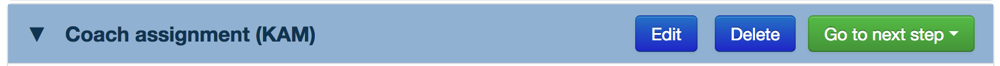
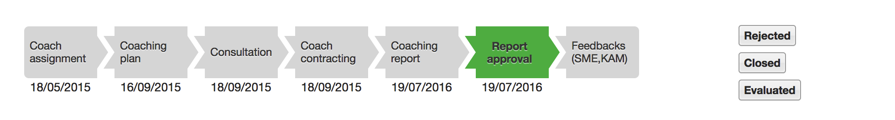

# User interface widgets vocabulary

This chapter describes the principal widgets (or UI components) composing the case tracker user interface. 

The widget generation process starts by generating a *page model* using the widget XML vocabulary. This vocabulary is often interleaved with page content extracted from the database too. It is then transformed to HTML by the pipeline view step and sent to the optional epilogue step or directly copied to the response.

The resulting HTML contains _class_, _id_ and _microformat_ attributes (i.e. `data-*`) which are used to connect HTML *host elements* with a combination of Javascript [Commands](./commands.md), [Plugins](./doc/plugins.md), [Filters](./doc/filters.md) and [Bindings](./doc/bindings.md) that implement the widget behavior.

You can see the page model by adding the `.xml` suffix at the end of the resource URL (e.g. _/cases/100/activities/1.xml_).

The widgets are presented in alphabetical order, but basically the case tracker is made of top level widgets which are used to render the different pages :

- the `Search` widget implements all search pages (stage, regions, coaches, persons, enterprises)
- the `Display` widget implements the workflow pages (cases/x, cases/x/activities/y)
- the `Stats` widget implements the statistics pages (stats/cases, stats/activities, stats/kpi)
- the `Page` widget implements the management page  (management)

## XSLT and Javascript code layout

A case tracker design rule is to share a maximum of widgets vocabulary bewteen pages :

* `lib/commons.xsl` groups the most mature or generic widgets. It can be reused beyond the case tracker to make similar applications;
* `lib/widgets.xsl` groups less mature or application specific widgets. It can also be reused with small adaptations to make similar applications;
* finally per-module XSLT files (e.g. *modules/persons/search.xsl*, *modules/workflow/workflow.xsl*, *modules/management/management.xsl*, etc.) group specific widgets.

Basically the module specific XSLT files start with :

```xml
<xsl:include href="../../lib/commons.xsl"/>
<xsl:include href="../../lib/widgets.xsl"/>
```

The underlying philosophy is that as you make more and more mature and generic widget vocabulary, it should be moved *upwards* to widgets.xsl and ultimately to commons.xsl.

Reciprocally the Javascript widget code (mainly made of AXEL plugins, filters, bindings and commands) can be found in *resources/lib/commons.js* for the most generic, *resources/lib/widgets.js* for the application dependent one and finally into specific files (e.g. *search.js*, *workflow.js*, *management.js*, etc).

The CSS files for the UI Components are not specifically organized yet (this is a work in progress), in addition to the bootstrap CSS files you can find several CSS files in the *resources/css* folder.

**NOTE**: actually *resources/lib/widgets.js* is still under construction and is still splitted between *resources/lib/extensions.js* and *resources/lib/workflow.js*.

## User interface conventions

The case tracker uses a few conventions amongst which :

- formulars in read-only mode have a white background
- formular in editing mode have a blue background
- Case related documents are shown with an orange accordion bar 
- Activity related documents are shown with a blue accordion bar 

## Very frequent terms

The following attributes and elements are often reused with the same meaning : 

- `@loc` : dictionary key (defined in *config/dictionary.xml*) to localize an element's text
- `Template` : address of a formular to load to generate an editor (read-only or for updating or creating a resource)
- `Resource` : address of a resource to load into an editor (XML or blended if it contains some rich text fragments for read-only display)
- `Controller` : address of a controller to POST a current editor's content to create a new resource in database
- `Initialize` : address of a controller to use to load initial content into an editor (e.g. when creating a new resource)

The addresses are usually expressed with a *relative path*, hence they are mapping dependent.

## The `Accordion` widget

> In: workflow/workflow.xsl

The accordion widget vertically stacks one or more documents for viewing and editing. The number of documents depends of the workflow status. Each document occupies one accordion group which is either in a collapsed state or opened state. In both states the document bar shows the document name. Clicking the document bar opens/closes the accordion group and shows a menu with action on the right side of the bar.

The accordion widget is found in one of the tab view of a workflow page (case or activity).

The `Accordion` element defines an accordion widget. It contains one `Document` element for each document.

Example :

```xml
<Accordion CurrentStatus="1">
  <Document Status="current" class="case" Id="case-init">
    <Name loc="workflow.title.case-init">case-init</Name>
    <Resource>../../information.blend?goal=read</Resource>
    <Template>../../../templates/case-information?goal=read&amp;smegrant=1&amp;kamgrant=1</Template>
    <Actions>
      <Edit>
        <Resource>../../information.xml?goal=update</Resource>
        <Template>../../../templates/case-information?goal=update&amp;smegrant=1&amp;kamgrant=1</Template>
      </Edit>
    </Actions>
  </Document>
</Accordion>
```

Illustration (all bars collapsed) :


### The `Document` element

The `Document` element defines a document editor in an accordion group. It is initially loaded with a template and a resource in read-only mode using the Javascript *view* command. Opening the accordion group shows the document editor. When editing the document, the actions menu is replaced with an editing menu with at least a *Save* and a *Cancel* button, this menu is duplicated at the bottom of the document.

The `Template` element contains the address of the formular to use to generate the document view.

The `Resource` element contains the address of the document load into the document view.

The `Actions` element defines the commands that can be applied to the document and/or the workflow.

Example :

```xml
<Document Status="current" class="case" Id="case-init">
  <Name loc="workflow.title.case-init">case-init</Name>
  <Resource>../../information.blend?goal=read</Resource>
  <Template>../../../templates/case-information?goal=read&amp;smegrant=1&amp;kamgrant=1</Template>
  <Actions>
    <Edit>
      <Resource>../../information.xml?goal=update</Resource>
      <Template>../../../templates/case-information?goal=update&amp;smegrant=1&amp;kamgrant=1</Template>
    </Edit>
  </Actions>
</Document>
```

Illustration (with a document displayed in read-only mode) :


### The `Actions` element

The `Actions` element inside the `Document` element defines a list of actions to generate in the accordion group menu bar. The actions are context dependent (workflow status and user's roles).

Example : 

```xml
<Actions>
  <Edit>
    <Resource>../../information.xml?goal=update</Resource>
    <Template>../../../templates/case-information?goal=update&amp;smegrant=1&amp;kamgrant=1</Template>
  </Edit>
</Actions>
```

Illustration :



#### The `Edit` action

The Edit action replaces the read-only formular by a document editor. This happens by loading a formular and by reloading the document content into it. If you are using Supergrid to generate formulars, the templates for viewing and for editing are the same one rendered in different modes. The rendering mode is usually selected with a *goal=[read | update | create]* parameter of the template URL.

The `Template` element contains the address of the formular to use to generate the document editor.

The `Resource` element contains the address of the document load into the document view.

The *Save* button executes a Javascript *save* command that posts the current editor content to the server. The *Cancel* button executes a Javascript *trigger* command that sends an _axel-cancel-edit_ event to the document editor. As a consequence a Javascript *view* command which is linked to the document restores the document read-only view.

The optional `@Forward` attribute generates a extra *Save & Submit* button. That button triggers a Javascript *save* command that posts current data to the server, but it replaces all parameters from the resource URL (like *?goal=update*) with its value. 

For instance with *Forward="submit"*, a `1/funding-request.xml?goal=read` document resource will be posted to `1/funding-request.xml?submit`. Then the CRUD controller should interpret this to perform additional actions, like returning a `forward` element to the Ajax response to trigger another client-side action. This is typically used for triggering an automatic workflow status change.

Example :

```xml
<Edit Forward="submit">
  <Resource>funding-request.xml?goal=update</Resource>
  <Template>../../../templates/funding-request?goal=update</Template>
</Edit>
```

Illustration (menu added after clicking on an Edit action) :


#### The `ChangeStatus` action

The `ChangeStatus` element specifies a drop down menu where each option changes the workflow status.

The text of the option is generated from the value of the target `@To` attribute (target status number) and from a `Dictionary` element that must be part of the page model and is shared with the `Workflow` widget (see below).

The `@Status` attribute is the current status while the `@Argument` attribute is the number to add or withdraw depending on the `@Action` attribute to go to the target `@To` status.

Example : 

```xml
<ChangeStatus Status="4" TargetEditor="c-alert">
  <Status Action="increment" Argument="1" To="5"/>
  <Status Action="decrement" Argument="2" To="2"/>
  <Status Action="increment" Argument="5" To="9"/>
</ChangeStatus>
```

Illustration :


## The `Cartouche` widget

> In: workflow/workflow.xsl

The `Cartouche` element  defines the window title (`Window` element) and the page title (`Title` element) to display in a workflow page.

Example : 

```xml
<Cartouche>
  <Window>BIOVALID coaching activity (18/03/2015)</Window>
  <Title LinkToCase="907">Clinical validation of the DiviTum assay in two high profile clinical ...</Title>
</Cartouche>
```

## The `Commands` widget

> In: lib/widgets.xsl, modules/stats/stats.xsl

The `Commands` element groups together several commands to form a kind of menu bar.

Actually this is a logical element that has several implemenations depending on where it is used : 

- in modal windows
- in search mask formulars
- in statistics masks formulars

Example (from *Community > Person profile* search page) :

```xml
<Modal Id="c-item-viewer" Goal="read">
  <Template>templates/person?goal=read</Template>
  <Commands>
    <Delete/>
    <Button Id="c-modify-btn" loc="action.edit"/>
    <Close/>
  </Commands>
</Modal>
```
    
Illustration :


### Note on commands

Actually two systems coexist to name the commands, one for modal windows and another one for formulars. 

Basically a command is generated as an HTML `button` element with micro-format instructions to configure a Javascript *command* object. 

For instance here is the XSLT rule that generates the Close command in a Modal widget from the previous example :

```xml
<xsl:template match="Close" mode="Modal">
  <button class="btn" data-command="trigger" data-target="{ancestor::Modal/@Id}" 
          data-trigger-event="axel-cancel-edit" loc="action.close"
          >Fermer</button>
</xsl:template>
```

## The `Display` (top level) widget

> In: modules/workflow/workflow.xsl, modules/management/management.xsl

The Workflow view is constructed from a `Display` root element that contains the following widgets : Cartouche, Workflow (timeline widget) and a Tabs widget with different contents such as an Accordion tab containing all the case and/or activity documents, some Drawer tabs to send and view e-mail messages, etc.

**NOTE**: *DEPRECATED*, to be replaced with the `Page` element

## The `Drawer` widget

> In: workflow/workflow.xsl

TBD

Illustration :


## The `Formular` widget

> In: lib/search.xsl (stage page), lib/widgets.xsl (search pages), modules/stats/stats.xsl (stats pages)

The formular widget looks like a search mask with a menu containing one or more command buttons at the bottom. It contains at least one command button to submit the search request. It is commonly associated with a result table updated either directly from the HTML fragments returned by the request response, or using the Ajax JSON table protocol as described in the [Ajax protocols](./ajax.md) chapter. The formular is loaded when the page is ready.

The `Template` element contains the address of the formular to load to generate the search mask. The `@loc` attribute is the dictionary key for the formular title that will be displayed above the search mask.

The optional `Submission` element associates the search formular with a default search request that the user can save into his/her profile (we call it a *default filter*). This default filter is initially loaded into the search mask. The submission functionality is implemented by the *modules/submission* module.

The `Commands` element groups command elements to be displayed in the footer. 

The following commands are defined in *lib/widgets.xsl* for a search formular : 

- `Create`: Javascript *add* command
- `Save`: Javascript *save* command

The following commands are defined in *modules/stats/stats.xsl* for a stats formular : 

- `Command` : see second example below

The `Submission` attribute adds three commands to the left side of the meny to save, load or clear default filter.

Example (from Community > Person profile search page) :

```xml
<Formular Id="editor" Width="680px">
  <Template loc="form.title.persons.search">templates/search/persons</Template>
  <Submission Controller="persons">persons/submission?name=SearchPersonsRequest</Submission>
  <Commands>
    <Create Target="c-item-creator">
      <Controller>persons/add?next=redirect</Controller>
      <Label loc="action.add.person">Ajouter une personne</Label>
    </Create>
    <Save Target="editor" data-src="persons" data-replace-target="results" data-save-flags="disableOnSave silentErrors" onclick="javascript:$('#c-busy').show()">
      <Label style="min-width: 150px" loc="action.search">Search</Label>
    </Save>
  </Commands>
</Formular>
```

Illustration :


Second example (from Statistics > Cases page) : 

```xml
<Formular Id="editor">
  <Template>../templates/stats-cases</Template>
  <Commands>
    <Command Allow="g:admin-system g:business-intelligence" Name="submit" Action="export?t=anonymized" Form="e1" W="3" Offset="1">Anonymized Exportation</Command>
    <Command Allow="g:admin-system" Name="submit" Action="export?t=all" Form="e2" W="2">All Exportation</Command>
    <Command Allow="g:admin-system" ExcelAllow="g:admin-system" Name="submit" Action="export?t=list" Form="e3" W="2">Contact List</Command>
    <Command Allow="g:admin-system g:business-intelligence" Name="stats" Action="filter" W="2">Statistics</Command>
  </Commands>1
</Formular> 
```

Note that in that case the `Template` element does not have a `@loc` attribute since the title is directly inside the formular. 

The `@Allow` attribute contains the value *disabled* if the user is not allowed to use the underlying functionality in which case the button will not be generated. Otherwise its value is not used by the widget. 

Note that for statistics the formulars are copied from their definition in the *modules/stats/stats.xml* file. The `@Allow` attribute is the only one which is computed from its initial specification.

The optional `Submission` element is not supported in that context.

The `Commands` widget for the statistics pages use some *W(idth)* and *Offset* attributes to layout the command buttons along a bottom row of of the formular using grid units as with Supergrid formular vocabulary.

## The `Modals` widget

> In: lib/search.xsl, modules/workflow/workflow.xsl 

The `Modals` element parent groups together all the modal window contained in a page. Each one is declared with it own `Modal` element. THere should be only one `Modals` per page.

### The `Modal` element

The modal editor windows contain a formular for presenting and/or editing application resources. They are implemented by a bootstrap modal window with three parts :

* a header : window title
* a body : generated formular-based editor
* a footer : command buttons (e.g. save, delete, etc.)

Example :

```xml
<Modal Id="c-nologin-editor" data-backdrop="static" data-keyboard="false">
  <Name>Creation of a user account</Name>
  <Template>templates/account?goal=create</Template>
  <Commands>
    <Save>
      <Label>Create</Label>
    </Save>
    <Cancel/>
  </Commands>
</Modal>
```

The `Name` element is the modal window title to appear in the header.

The `Template` element is the address for the template to render inside the body. Note that since it is using a relative path, the URL will be based on the current URL so this is mapping dependent. 

You can use a modal without a `Template` to generate a plain modal window without a formular. In that case some Javascript code will find it with its *Id* and load data loaded with an Ajax request inside it.

The `Commands` element groups command elements to be displayed in the footer. The following commands are defined in *lib/widgets.xsl* :

- `Save`: Javascript *save* command
- `Delete`: Javascript *c-delete* command
- `Close` and `Cancel` (Javascript *trigger* command)
- `Clear` (custom one line Javascript)
- `Password` (Javascript *c-passsword* command)
- `Button` (custom Javascript to be bound by *@Id*).

Illustration :


The search pages (persons, regions, enterprises) make an heavy use of modal windows to edit the corresponding resources. They are implemented with plain vanilla Javascript and with AXEL commands (see *resources/lib/search.js*). The management user interface also works the same way (see *resources/lib/search.js* and open */management.xml* to view the modal windows definitions).

## The `Overlay` widget

> In: lib/commons.xsl  

The `Overlay` widget hosts components to be displayed temporarily on top of the page. For that purpose it generates a `site:overlay` view extension point to be inserted into the page mesh.

It is used in Community > Coach community search to inspect coach profiles while searching for coaches on criteria without loading a new page.

This component can only be used with a mesh containing a *site:overlay* extension point. It can contain any other widget.

## The `Page` (top level) widget

> In: lib/commons.xsl

The `Page` element is the top-level container for the management view. It has been moved to *commons.xsl* since it is considered now as the standard top-level element to configure a page and to generate the `site:view` document. 

The optinal `@skin` attribute can be used to link the page with specific skins. It contains a whitespace list of tokens that refer to the names of untyped `profile` elements of *config/skin.xml* configuration file.

## The `Search` (top level) widget

> In: lib/{entity}/search.xsl

The `Search` element is the top level container for the search pages implemented with *lib/search.xsl*.

**NOTE**: *DEPRECATED*, to be replaced with the `Page` element

## The `Stats` (top level) widget

> In: modules/stats/stats.xsl

The `Stats` element is the top level container for the statistics pages implemented with *modules/stats/stats.xsl*.

**NOTE**: *DEPRECATED*, to be replaced with the `Page` element

## The `Tabs` widget

> In: lib/widgets.xsl

The `Tabs` element generates a tab view. It contains one `Tab` element for each tab. The Tabs view is splitted in two areas: a tab menu with one entry for each tab, and a tab view area where one active tab is displayed at a time.

It is actually used to implement the workflow tabular view (case and activity workflow pages) and the management page.

Example :

```xml
<Tabs>
  <Tab Id="users" class="active">
      <Controller>management/users</Controller>
      <Name>Users</Name>
      <h2>Instructions to administrators</h2>
      <p>Start by clicking on a tab on the left to do something...</p>
  </Tab>
  <Tab Id="roles">
      <Controller>management/roles</Controller>
      <Name>Roles</Name>
  </Tab>
  <Tab Id="login">
      <Controller>management/login</Controller>
      <Name>Login</Name>
  </Tab>
  ...
</Tabs>
```
 
Illustration : 


The tabs widget is implemented with bootstrap tabbable nav component.

### The `Tab` element

The `Tab` element defines a tab meny entry and a tab view. 

The `Name` element defines the label to display on the tab navigation bar.

The optional `Controller` element contains the address of the resource to load when displaying the tab. If present, the tab SHOULD make an Ajax request to load that resource on the tab `show` event. You can find some examples in *resources/lib/management.js*.

Example (Roles tab in Admin page):

```xml
<Tab Id="roles">
  <Controller>management/roles</Controller>
  <Name>Roles</Name>
</Tab>
```

## The `Window` widget

> In: lib/commons.xsl

Generates a window title implemented as an HTML `title` element. The text can be localized usin the `@loc` attribute directly on the `Window` element.

It MUST be supported at the mesh level by a `site:window` extension point inside the *head* section. Note that this is different from the page title which is usually inserted inside a `site:title` extension point.

## The `Workflow` widget

> In: modules/workflow/workflow.xsl

It defines the timeline to be printed on top of the page, just below the title. It contains some `Step` elements for displaying the workflow status boxes. The `@Display` attribute defines wether its a regulare state (*step* value) or a terminal state (*state* value) to be displayed stacked on the right side.

Example :

```xml
<Workflow W="10" Name="Activity">
    <Step Display="step" Status="current" StartDate="13/01/2016" Num="1"/>
    <Step Display="step" StartDate="" Num="2"/>
    <Step Display="step" StartDate="" Num="3"/>
    <Step Display="step" StartDate="" Num="4"/>
    <Step Display="step" StartDate="" Num="5"/>
    <Step Display="step" StartDate="" Num="7"/>
    <Step Display="step" StartDate="" Num="8"/>
    <Step Display="state" StartDate="" Num="9"/>
    <Step Display="state" StartDate="" Num="10"/>
    <Step Display="state" StartDate="" Num="11"/>
</Workflow>
```

Illustration :



Note that the step names MUST also be part of the `Display` element in a first-level `Dictionary` element that gives the name of each status identified by its number *Id*. 

```xml
<Dictionary>
  <WorkflowStatus Name="Activity" W="10">
      <Status>
          <Id>1</Id>
          <Name>Coach assignment</Name>
      </Status>
      ...
  </WorkflowStatus>
</Dictionary>
```
