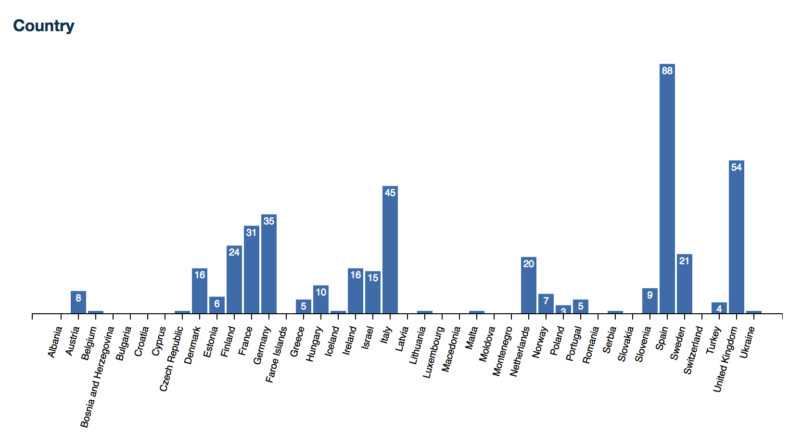
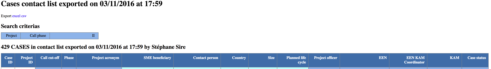

# Statistics specification language

The statistics module allows to select case and/or activity samples based on multiple criteria and to present the results on graphs and on export tables. The criteria can be entered on a mask generated with Supergrid formulars. The statistics specification language defines the graphs, export tables, and access rights to export tables with a limited XML vocabulary.

## Implementation

The statistics module is implemented in the `modules/stats` folder :

* pages with search masks are generated with the `modules/stats/stats.xql` model and `modules/stats/stats.xsl` view
* graph generation service is done by `modules/stats/filter.xql`
* table export is done by `modules/stats/export.xql`

The search masks are available in the `formulars` folder of the application, together with the other document XML formular specifications since they use the same Supergrid generator.

All these scripts interpret the statistics configuration file `modules/stats/stats.xml` which must be deployed in the application configuration and which is written using the statistics specification language.

The graph generation is a JSON service that also heavily relies on a `resources/lib/stats.js` Javascript file (and on the d3.js third party library) to implement a great part of the computations to offload the server. 

The table export currently directly generates HTML tables with a short embedded Javascript function to expand the labels to lower the bandwidth required. It should be replaced with a JSON table export too in the future.

## Examples

### A search mask definition

This example loads the *../templates/stats-cases* formular into the search mask with 4 command buttons: *Anonymized Exportation*, *All Exportation*, *Contact List* and *Statistics*. The *All Exportation* command is only available to system administrators, region managers, or managers of the cases.

```xml
<Formular>
  <Template>../templates/stats-cases</Template>
  <Command Allow="g:admin-system g:business-intelligence g:region-manager g:kam" Name="submit" Action="export?t=anonymized" Form="e1" W="3" Offset="1">Anonymized Exportation</Command>
  <Command Allow="g:admin-system g:region-manager g:kam" Name="submit" Action="export?t=all" Form="e2" W="2">All Exportation</Command>
  <Command Allow="g:admin-system g:region-manager g:kam" ExcelAllow="g:admin-system" Name="submit" Action="export?t=list" Form="e3" W="2">Contact List</Command>
  <Command Allow="g:admin-system g:business-intelligence g:region-manager g:kam" Name="stats" Action="filter" W="2">Statistics</Command>
</Formular>
```

### A frequency bar diagram definition

This example graph displays the frequency bar diagram by country for a set of cases. Each bar legend is rotated with a 75 degrees angle from the horizontal, is shifted 120 pixels to the bottom and 20 pixels to the left.

```xml
<Chart>
  <Layout>
    <Angle>75</Angle>
    <Bottom>120</Bottom>
    <Left>20</Left>
  </Layout>
  <Set>Cases</Set>
  <Title>Country</Title>
  <Variable Selector="Countries">Co</Variable>
</Chart>
```

Charts are pre-embedded into a statistics page (Case, Activity or KPI statistics for instance) using HTML microformat attributes. The SVG graphs and the tables are dynamically generated in Javascript on reception of the JSON data set.



## A table export definition

This example exports a table with 15 columns with different background colors as specified by the `@BG` attribute (note that actually colors are hard-coded into the `modules/stats/export.xql` controller). That table corresponds to the export command with the *list* type parameter as coded in the HTTP request query parameter *t* (see above in *A search mask definition* the *Contact list* command).

```xml
<Table Type="list" Page="cases">
  <Headers Lang="en">
    <Header BG="none">Case ID</Header>
    <Header BG="none">Project ID</Header>
    <Header BG="case">Call cut-off</Header>
    <Header BG="case">Phase</Header>
    <Header BG="case">Project acronym</Header>
    <Header BG="enterprise">SME beneficiary</Header>
    <Header BG="enterprise">Contact person</Header>
    <Header BG="enterprise">Country</Header>
    <Header BG="enterprise">Size</Header>
    <Header BG="enterprise">Planned life cycle</Header>
    <Header BG="case">Project officer</Header>
    <Header BG="case">EEN</Header>
    <Header BG="case">EEN KAM Coordinator</Header>
    <Header BG="case">KAM</Header>
    <Header BG="case">Case status</Header>
  </Headers>
</Table>
```

