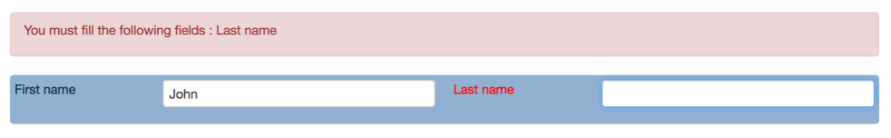
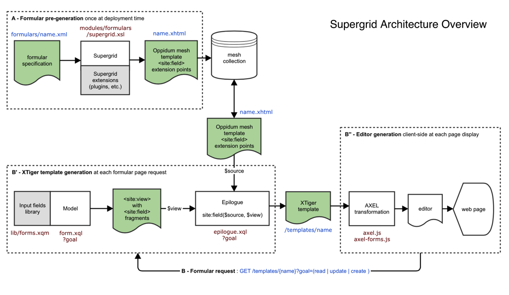
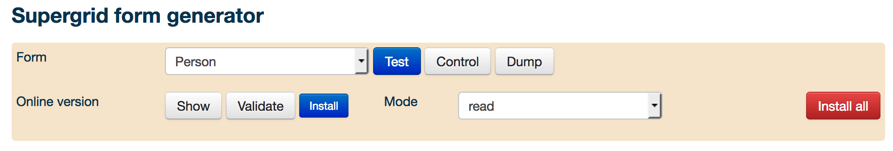

# Supergrid

Supergrid transforms a formular definition into a formular template. 

The formular definition is an XML file that uses an XML vocabulary to create forms with basic editing constraints on a grid-based layout. 

The formular template is an XTiger template that contains extension points to dynamically generate some data dependent input fields (e.g. a list of registered user names, etc.). 

The formular template can be embedded into any web page using a javascript library, called AXEL, that will turn it into an active editor that we call a supergrid form.

A particularity of supergrid forms is that they output XML documents conformant with an implicit XML model embedded into the initial formular definition.

The exemple below shows a very basic formular specification with two single line text entry fields. The second field is mandatory.

    <Form Tag="Name">
      <Row>
        <Field Key="fn-name" Tag="FirstName" Gap="2" W="6">First name</Field>
        <Field Key="ln-name" Tag="LastName" Gap="2" W="6">Last name</Field>
      </Row>
      <Bindings>
        <Require Keys="ln-name"/>
      </Bindings>
      <Plugins>
        <Input Keys="fn-name ln-name"/>
      </Plugins>
    </Form>

This form visualized in the Supergrid simulator tool is shown below. As you can see the second field is mandatory and validation outputs validation error messages. The validation output message container is fully configurable when you embed your form into a page. 

This form generates output such as :

    <Name>
      <FirstName>John</FirstName>
      <LastName>Doe</LastName>
    </Name>
    
Practically the formular definition must be mapped to a specific URL that return its XML content for supergrid to find it and generate the formular template. By convention we use a `/form/name` URL for that purpose; the pre-generated formular template is available under a `templates/name.xhtml` URL.

Formular templates generated with Supergrid can be rendered in 3 different modes : a read-only presentation mode, an update mode to update existing data and a create mode to create new data. This is indicated with a request *goal* parameter (resp. *read*, *update* or *create*) of the formular template URL. This allows to use a single formular definition for multiple purposes.

## XML Language Characteristics

The Supergrid language abstracts three languages : Oppidum mesh language, XTiger language and a grid layout language. As a consequence formular specifications are easier to read and shorter because they are written with a specific and limited XML vocabulary.

The Supergrid language can also embed any markup : everything not in Supergrid vocabulary will be recursively copied to the output. This way it is possible to integrate specific HTML elements directly into the formular specification. But you can also use that feature to directly embed XTiger XML elements.

The grid and final look-and-feel of the forms is actually implemented with Bootstrap 2.3.2 CSS framework. This can be adapted by updating the Supergrid XSLT transformation and providing the adequate CSS files.

### The Oppidum Mesh Language

The mesh elements are identified with the _site:_ prefix bound to the "http://oppidoc.com/oppidum/site" namespace. The mesh language specifies conditional blocks and extension points which are rendered dynamically by epilogue.xql. The conditions depends on the HTTP request parameters. The extension points are copied from the view output of the Oppidum pipeline. 

One of the benefit of using supergrid is that the extension points can be rendered for different purposes like generating different templates to create, update or read a resource. In the later case, the epilogue rendering function dynamically replaces the extension points with constant fields. Thus a unique formular source can be used for editing or for viewing data. There is no need to maintain for instance an XTiger XML template for creating a resource, another one for updating a resource and an XSLT transformation for viewing it.

### The XTiger Language

The XTiger XML elements are identified with the _xt:_ prefix bound to the "http://ns.inria.org/xtiger" namespace.

The XTiger language specification is available [online](http://ssire.github.io/xtiger-xml-spec/). Unless you need to edit specific XML constructs with your form, you do not need to directly use the XTiger language inside a forms specification.

## Architecture overview

Supergrid transforms a formular specification written in XML into an XHTML document which is both :

* an Oppidum mesh document template containing *holes* (or extension points) to be filled later
* an XTiger XHTML document template skeleton to be turned into a web-base formular by the AXEL library client-side

The Supergrid XSLT transformation is applied once at deployment time (usually as a *forms* target of a deploy script). Its XHTML document output is copied to the application mesh collection.

The formular to render inside an HTML page is retrieved via an Ajax HTTP request (usually at a *templates/{name}* URL address). 

It returns an XTiger XHTML document template obtained by filling the extension points of the Oppidum mesh with concrete XTiger elements that instiate different kind of input fieds (drop down selection lists, calendar, single line text input, multiple lines text input, photo upload, etc.). That step allows to dynamically generate input fields, like dynamical list of entities generated from the latest database content. 

The XTiger template is itself turned into an editor by the AXEL javascript library client-side. 

The Oppidum pipeline that turns the Oppidum mesh into an XTiger template is a two steps pipeline with a model and an epilogue (no view).

By convention the model is called _form.xql_. It is common practice to serve several formular models from a single _form.xql_ file mostly to factorize input fields (e.g. a country list, NOGA classification, etc.). It is also common to create a _form.xqm_ library per application, with helper functions to generate classical types of input fields (i.e. drop-down list selectors).

Finally a filtering mechanism allows the model and the epilogue script to decide at the last minute to replace all the input fields by read-only fields. This is convenient to reuse a single formular definition not only for editing but also for viewing data without allowing editing. This filtering is usually driven by *goal* parameter passed to the formular HTTP request which is set to *read* for a read-only formular, and respectively to *update* or *create* for an update or creation formular.

This is illustrated on the figure below.

## Usage

### Supergrid installation

To install Supergrid formulars and the simulator you need to copy the `modules/formulars` directory to your application. Then you need to copy this entry to your application mapping file to map it on the `/forms` URL :

    <item name="forms" resource="file:///formulars/_register.xml" supported="install" epilogue="formulars">
      <access>
        <rule action="GET" role="u:admin g:admin-system" message="system administrator"/>
        <rule action="install" role="u:admin" message="system administrator"/>
      </access>
      <view src="modules/formulars/simulator.xsl"/>
      <item resource="file:///formulars/$2.xml"/>
      <action name="install" resource="">
        <model src="modules/formulars/install.xql"/>
      </action>
    </item>

You can fine tune access rules to the Supergrid simulator with the `@role` attribute of the `rule` element.

You also need to add the following skin to your application `config.skin.xml` file :

    <profile name="formulars" type="mesh">
      <link href="bootstrap/css/bootstrap.css"/>
      <link href="css/site.css"/>
      <link href="css/forms.css"/>
      <predef avoid="error()">axel-1.3-no-jquery</predef>
      <predef avoid="error()">date</predef>
      <script src="bootstrap/js/bootstrap.min.js"/>
      <predef>select2</predef>
      <script src="lib/formulars.js"/>
      <script src="lib/extensions.js"/>
      <predef>photo</predef>
    </profile>

Do not forget to make all the Javascript and CSS files from the skin available in your application *resources* folder on the file system.

To test and use forms generated with Supergrid you also need to include the CSS rules for your grid layout, look-and-feel and forms widgets into your application, and the eventual associated javascript files too. This is the purpose of the _forms.css_ CSS file. In general it contains rules to overwrite specific underlying grid layout rules or default AXEL rules, but also rules to implement higher level widgets. The _forms.js_ file is the implementation of the Supergrid simulator. 

You will get a basic GUI for testing and generating the formulars called the _Supergrid simulator_. You will also get some install functions that you can use to create deployment scripts. 

### Supergrid simulator

The Supergrid simulator allows to select a form, to test it and to generate the formular template into the `mesh` collection of your application.

The simulator is controlled from the menu shown below. The *Install* and *Install all* buttons are displayed only if you have the rights to record the generated forms to the `mesh` collection in your application database. When testing a form with the *Test* of *Show* button, the simulator generates the form editor below the menu so you can try it.

The *Form* drop down list allows to select the form. It's filled with the content of the `formulars/_register.xml` file in your file system.

The *Test* button runs the form model through a partial supergrid transformation where all the extension points of the form are replaced with a default input field (a drop down list selector). This allows to quickly get a preview of the form without requiring to write the `form.xql` model to generate the extension points. The static input fields declared under the `Plugin` section are generated as they would be by the complete supergrid transformation.

The *Control* button runs the form model through a partial supergrid transformation where all the extension points of the form are replaced with a `key[Tag,W]` string where  *key* (resp. *Tag*) is the name of the key (resp. Tag) associated to the field. *W* is the width (in grid column units) occupied by the entry field (not including its label).

For instance a field like :

    <Field Key="likert-scale" Tag="RatingScaleRef" Gap="3" W="12">The top management ...</Field>

Would appear as `likert-scale[RatingScaleRef,9]` with the *Control* transformation.

That control view of a form is useful when writing the `form.xql` model that generates the extension points content, since for each extension point in the control view, you must generate a `<site:field Key="key">` element.

The *Dump* button is only meaningful if you have transformed a form with the *Test* or *Show* buttons. It opens up a modal window where it dumps the current content of the form in the editor. This is useful to check the XML ouput content model of a form.

The *Show* button runs the form model through a complete supergrid transformation and renders it through a complete pipeline including the `form.xql` model that generates the dynamical entry fields with the current database content. It renders it with the goal parameter set to the current value of the *Mode* selector.

The *Validate* button is only meaningful if you have transformed a form with the *Show* buttons. It runs an AXEL-FORMS validation of the form in the editor with its current content and shows errors in a reserved area at the top. The validation is the same one as executed by the 'save' command.

The *Mode* selector is a drop down list allows that selects the goal parameter passed to the generator. It actually defines 3 goals, *read* for read-only, *update* for editing an existing resource and *create* to create a new resource. 

The *Install* button runs the form model through a complete supergrid transformation and copy the resulting template to the `mesh` collection. 

The *Install all* button is the same as the *Install* button but it installs all the forms defined in the `formulars/_register.xml` file. 

Thhe rights to use the installation buttons depends on the access rules configured in the application mapping (see [Supergrid Installation](#supergrid-installation)).

### New formular installation

Each formular requires to map 2 resources in the application mapping :

- the formular XML definition to allow the Supergrid simulator to generate and record the pre-generated template
- the formular template to allow to serve a template file ready for transformation by the AXEL Javascript library client side to create an editor

The generic `<item resource="file:///formulars/$2.xml"/>` mapping entry (see [Supergrid Installation](#supergrid-installation) works for all the formular XML definition files, hence you do not need to create one entry per file. However you need to create one mapping entry per formular template as explained below.

Each formular XML definition file must be available in your application top-level *formulars* directory. Then it must be registered in the `formulars/_register.xml` file as a *Formular* element like :

    <Formular>
      <Name>Person (search)</Name>
      <Form>forms/person-search</Form>
      <Template>templates/search/persons</Template>
    </Formular>

The `Name` element is the label that will appear in the Supergrid simulator menu option.

The `Form` element is the URL of the resource that will serve the formular XML definition file to Supergrid simulator. Since it will be server by the ) it must ends with the name of the formular XML definition file with no suffix *xml*.

The optional `Template` element is the name of the formular resource that will serve the complete XTiger formular to the AXEL Javascript library for client-side transformation to an editor.

You need to create a corresponding entry in your application mapping file. By convention this entry declares a pipeline for generating the `site:field` extension points with a `form.xql` model to be inserted into the pre-generated formular template mesh to generate the dynamical formular template. So for instance if you have a *persons* module with a formular *persons-search* mapped onto the `/templates/search/persons` URL (as declared in the *Formular* element above) you should also add the following entries to the application mapping :

    <item name="templates">
      <item name="search">
        <item name="persons" epilogue="persons-search.xhtml">
          <model src="modules/persons/form.xql"/>
        </item>
      </item>
      ...
    </item>
    
If `Template` is missing it is assumed to be mapped onto the `/templates/name` URL where name is the name of the formular XML definition file with no suffix *xml*. You still need to explicitly declare the corresponding mapping entry in the application mapping.

### Epilogue 

To understand the role of the *site:field* function of the `epilogue.xql` script let's consider a formular XML definition file with a field identified with a *country* key :

    <Field Key="country" Tag="Country" Gap="1">Country</Field>

the pre-generated template mesh stored into the database (for instance with the *Install* button of the Supergrid generator) will contain a *country* extension point :

    <site:field force="true" Size="11" Key="country" Tag="Country">country[Country,NaN]</site:field> 

then, each time the formulat template is requested to generate an editor in the browser, the formular template pipeline will execute the `form.xql` XQuery model. This should dynamically generate a view where all the data to fill the extension point is wrapped it into a `site:field` element too :

    <site:field Key="country">
      <xt:use hit="1"  types="choice" values="AL AT BE BA BG HR CY CZ DK EE FI FR DE FO  GR HU IS IE IL IT LV LT
      LU  MK MT  MD ME  NL NO  PL PT  RO RS  SK SI  ES SE  CH TR  UK UA"  i18n="Albania Austria  Belgium Bosnia\  and\
      Herzegovina  Bulgaria Croatia  Cyprus Czech\  Republic  Denmark Estonia  Finland France  Germany Faroe\  Islands
      Greece  Hungary Iceland  Ireland Israel  Italy Latvia  Lithuania Luxembourg  Macedonia Malta  Moldova Montenegro
      Netherlands Norway  Poland Portugal  Romania Serbia  Slovakia Slovenia Spain  Sweden Switzerland  Turkey United\
      Kingdom  Ukraine" param="select2_dropdownAutoWidth=true;select2_width=off;class=span12  a-control;filter=select2
      optional;multiple=no;typeahead=yes"/>
    </site:field>

note that this can be done with a `lib/form.xqm` function such as :

    <site:field Key="country">
      { form:gen-country-selector($lang, " optional;multiple=no;typeahead=yes") }
    </site:field>

Finally the epilogue `site:field( $cmd as element(), $source as element(), $view as element()* )` function will be called with the *site:field* element from the pre-generated template in the `$source` parameter, and the *site:field* element from the formular template pipeline in the `$view` element. The function will replace the first one with the content of the second one. 

The `site:field` function is a little more complex in reality as it will also take into account the request *goal* parameter to perform some automatic fields substitutions. For instance when the goal is set to *read* it will automatically turn input fields into constant fields to generate a read-only formular template.

### Formular integration into a web page

Explain : 

    <Formular Width="680px" Submission="persons/submission?name=SearchCoachesRequest">
      <Commands>
        <Save Target="editor" data-src="match/criteria" data-type="json" data-replace-type="event" 
          data-save-flags="disableOnSave silentErrors" onclick="javascript:$('#c-busy').show();$('#c-req-ready').hide();">
        <Label style="min-width: 150px">Search</Label>
      </Save>
      </Commands>
    </Formular

### Supergrid extension

You can plug an play extensions into Supergrid. You can create new vocabulary elements for all the categories of a supergrid form components (bindings, plugins, modal windows). They consist of XSLT template rules matching those elemnt names and invoked from the proper context of the main Supergrid transformation. For that purpose you can include the extension at the begining of the Supergrid XSLT file. Usually extensions are bound to a new XML element name (e.g. the _tabular.xsl_ extension to create cross-product table from two selectors lists with the `ProductTable` element).

## XML Language Specification

### The `Form` element

> Contained in: document root
>
> Contains: Verbatim, Title, Row, Separator, Include, site:conditional, Modals, Commands, Bindings, Plugins, Hints

The `Form` element is the document root of a supergrid formular definition. 

Mandatory attributes :

* `@Tag` specifies the name of the root element of the XML output of the formular

Optional attributes :

* `@StartLevel` specifies the starting level for all the `Title` elements, for instance  when set to 1 a *Title* (w/o extra *Level* attribute) will be rendered by a `h1` element
* `@Width` specifies the desired width for generating the formular in the Supergrid simulator, note this is not necessarily the width that will be used in the application which is depending of the container

In addition you can specify namespaces used in the formular definition as in the next example :

    <Form Tag="Information" StartLevel="1" Width="800px"
      xmlns:site="http://oppidoc.com/oppidum/site"
      xmlns:xt="http://ns.inria.org/xtiger">
  
### The `Verbatim` element

> Contained in: Form
>
> Contains: one or more xt:component XTiger component definitions

The `Verbatim` element allows to generate a verbatim block in the `xt:head` section of the generated template. 

This is used to generate explicit XTiger components that you can later on instantiate into your grid layout with the `Use` element.

Note that the XTiger components (e.g. `xt:component` elements) may contain any markup or Supergrid markup. 
 
### The `Row` element

> Contained in: Form, Cell
>
> Contains: any element (most likely Field)

A `Row` element stacks one or more `Field` elements in lines of a maximum 12 grid unit width and with a fixed left margin (usually *15px*). The left margin allows to create grid gutters in regular layouts (e.g. each line containing two 6 grid units width fields). Each new Row element starts with a zero left margin.

The field placement algorithm in a row works as follows: if there are enough grid units available to contain the full field in the current line, then the field is inserted into the line, otherwise a new line is created that starts with the field. Note that except on the first line which has no left margin set, you must explicitely set the left margin to 0 on a new field on a new line using the `L="0"` attribute of the `Field` element. Alternatively you can also use a new `Row` element each time you want to create a line. This more explicit version is more verbose.

### The `Separator` element

> Contained in: `Form`

The `Separator` draws a horizontal separation line

### The `Cell` element

> Contained in: Row
>
> Contains: (Title | SideLink), any element (most likely Field or Row)

The `Cell` element content area uses fluid layout, so that means it will change the grid unit into its content so that 12 units correspond to 100% of the width of the cell content.

### The `Field` element

The `Field` element is the placeholder for a label followed by a data entry field.

The label is the text content of the element or a dictionary key if you use a `loc` attribute for internationalization. 

The nature of the data entry field is determined either by : 

- an input field in the *Plugins* section, it is statically generated once during form installation
- a`<site:field Key="...">` extension point generated by formular`s `form.xql` model, it is dynamically generated at each formular template generation

Mandatory attributes :

* `@Key` key to identify the field, note that the key may bot be unique in a given formular to share some declarations

Optional attributes :

* `@Label` to generate the correponding markup element in the XML output model
* `@Gap` : horizontal space left for label in grid units (0 means on top of data entry field)
* `@W` : total horizontal space occupied by the field in grid units (12 maximum)
* `@L` : left margin (usually set to 0 when vertically staking fields w/o wrapping them into rows)

### The `Modals` section element

#### The `Modal` element

The `Modal` element defines a modal window that loads an XTiger template.

The mandatory `@Id` attribute defines the modal identifier which is defined as _{@Id}-modal_. The identifier itself is used for identifying the editor generated inside the modal.

The modal window is actually implemented with a bootstrap modal (a header, a body and a footer).

The header displays a title configured with the `Title` element. By default it displays a cross to dismiss the modal window without performing any action. You can eventually remove the cross by adding a `@Dimiss="none"` attribute.

The body contains a pre-configured editor with a _transform_ command initialized with the template specified in the `@Template` attribute.

The `Footer` element defines the commands to display in the footer of the modal window.

If there is no `Footer` element the footer contains a Save and a Cancel buttons.

The Save button defines a _save_ command. The command will also duplicate save related events on the element targeted by the optional `@EventTarget` attribute. The optional `@SaveLabel` attribute can be used to change the label of the default Save button.

The Cancel button defines a _trigger_ command that sends an `axel-cancel-edit` event on the editor contained inside the modal.

### The `Commands` section element

> Contains: Add, Augment

TBD

### The `Bindings` section element

> Contains: Require, Enforce (RegExp)

The `Require` element makes an input field mandatory

The `Enforce` section declares some contraints elements. Actually there is only a `RegExp` constraint.

### The `Plugins` section element

> Contains: Constant, Date, Input, MultiText, Photo, Plain, RichText, Text

The `Plugins` section declares basic editing widgets. Each widget MUST BE associated with one or more `Field` instances of the formular, either through a *Key* or by the means of a *Prefix*. 

Most of the widgets are implemented by an AXEL plugin rendered with a single XTiger `xt:use` element. A few ones may also be complete higher level reusable XTiger components that will be copied to the formular inside one or more XTigger `xt:component` elements.

#### The `Constant` widget

The `Constant` element renders read-only content of different nature depending on the value of its *Media* attribute : 

- `@Media="html"` : displays an XHTML blob using AXEL 'html' plugin (XML input in that case is usually generated by the XSLT blender)
- `@Media="image"` : displays an image using AXEL 'constant' plugin
  -  the image URL will be obtained by concatanating `$xslt.base-url` with the optional `@Base` relative path that you can declare on the *Constant* element and the XML input
  - in case of empty XML input it will show `{$xslt.base-url}static/cctracker/images/identity.png`
  - set the `img-polaroid` class on the HTML `img` tag

#### The `Date` widget

TBD

#### The `Input` widget

TBD

#### The `MultiText` widget

TBD

#### The `Photo` widget

TBD

#### The `Plain` widget

The `Plain` element implements different types of editors depending on the value of its *Type* attribute :

- @Type="constant" :  
- @Type="text" :  
- @Type="number" :  

TBD

#### The `RichText` editor

The `RichText` element generated a complete XTiger component for editing rich text (paragraphs, lists, etc.).

TBD

#### The `Text` widget

The `RichText` element generated a complete XTiger component for editing rich text (paragraphs, lists, etc.).

TBD

### The `Hints` section element

TBD

