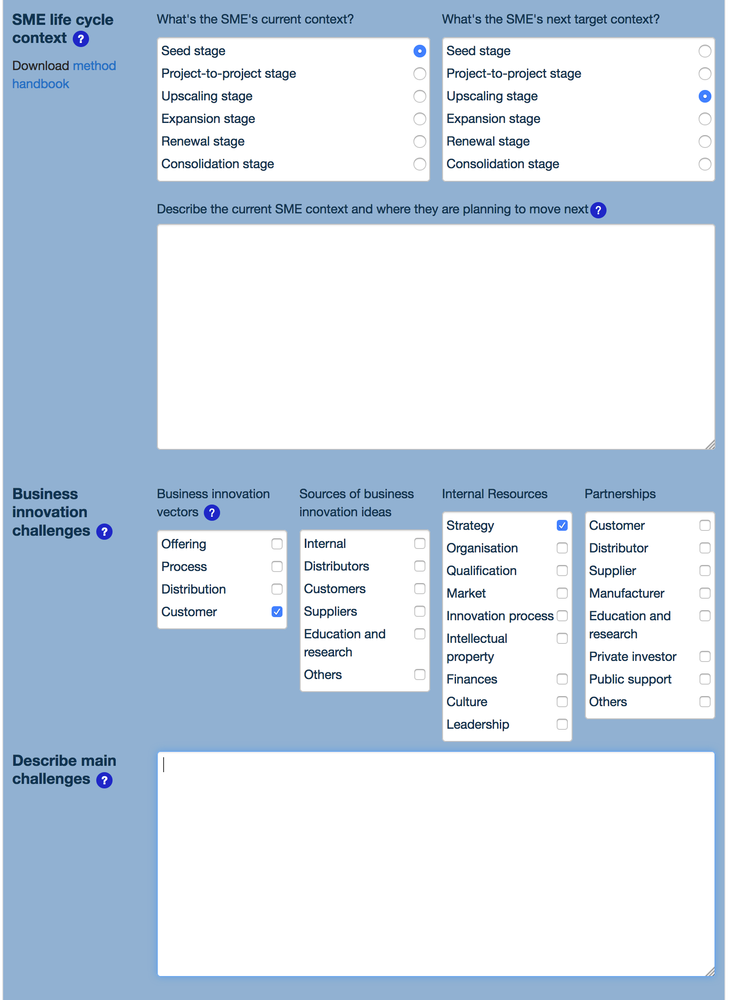

# Case Tracker features tour

## Use case

The case tracker manages **cases** and **activities**. One case can spawn zero or more activities.

There is one **case workflow** and one **activity workflow**

The workflows are linear workflows with possible return back and loops.

Each case and activity is represented by a set of **documents**. The available documents depend of the current workflow status of the case and of the activity. Each document is displayed the workflow accordion widget as a formular generated by the supergrid form generator. A single formular definition generates the static non editable document and the editable form.

The **users** have differents **roles**. Each role gives rights to :

* create cases and activities
* view case or activity documents
* edit case or activity documents

In addition the case tracker supports :

* search for cases, activities or users
* to do list computation and e-mail reminders
* statistics about cases and activites
* users and roles management

## Illustrations

All the formulars in the case tracker are generated from a high level XML specification with the [Supergrid](./supergrid.md) tool, hence they can be customized and change to fit whatever application and process data model.

### Dashboard

The dashboard is the interface to a search engine on cases and activities

### Workflow

The workflow is the main entry point to a case or an activity, it shows the workflow timeline, the case and activity documents, an history of the e-mail messages and much more...

### Editors

There are editors for every document in a workflow, the image below shows an extract of a case needs analysis document editor.

### E-mail

There are also editors to compose and send *e-mail* messages. They are archived into the application. The case tracker supports fully automated e-mail, semi-automated e-mail which are pre-filled and submitted to the user before sending, and manual e-mail as in the image below.

### Reminders

The reminders rule-based engine is run at fixed intervals. It computes reminder notifications which can be sent as e-mail messages to the involved actors and/or archived for daily consultation from the *To do* menu. The menu is personalized and shows only reminders relevant to the user.

### Search

In addition to the dashboard, there are also several **search** interfaces to access the database entities other than cases and activities.

### Statistics

All the case and activity data is available to generate statistics. A builtin statistics module allows to configure different kind of graphs and export tables as in the image below.

### Users management

Users are managed with builtin user management functionalities which are available only to a limited set of users.

The **account** window manages user's login and password credentials.

The **roles**. window manages user's list of roles. Roles are used by the workflow engine to dynamically grant case and activity access rights, and also to give access to different levels of case tracker functionalities. Some roles may also be bound to a specific case or activity, like beeing a coach in an activity.

